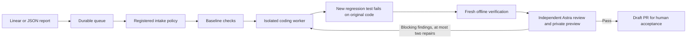

# SDLC Dispatcher

[](https://github.com/DylnMtthws/sdlc-dispatcher/actions/workflows/ci.yml)


**Turn approved feedback into independently verified code changes.**

SDLC Dispatcher is a Python orchestration service with signed Linear intake,
a durable SQLite queue, isolated Codex/Cursor workers, regression verification,
independent model review, and review-gated GitHub draft PRs. Register an application
with TOML and a trusted development image; the dispatcher does not import it.

The interesting part is what happens when things go wrong: feedback changes revoke
approval, moved commits invalidate evidence, lost provider responses trigger
reconciliation, and generated code never receives publication credentials.

**Start here:** [Architecture and tradeoffs](docs/architecture.md) ·
[Reproducible demo](#quick-start) · [Audit and validation](docs/audit.md) ·
[Contributing](CONTRIBUTING.md) · [Security](SECURITY.md)

**Status:** v0.1 is a single-host pilot, not a hosted service. Generic projects
default to manual approval. An optional Deck Lab release controller can merge and
deploy after a separately configured, verified human approval in Linear. Coding
agents and reviewers cannot authorize releases. See the
[release operating contract](docs/linear-release-handoff.md).



## Quick start

Requires Python 3.11+, Git, and a local Docker daemon. Run as an ordinary user.
The demo needs no credentials and makes no provider API calls.

```bash
git clone https://github.com/DylnMtthws/sdlc-dispatcher.git
cd sdlc-dispatcher
python3 -m venv .venv
.venv/bin/python -m pip install -e '.[server,dev]'
.venv/bin/sdlc-dispatcher init
docker build -f containers/test.Dockerfile -t sdlc-dispatcher-test:local .
.venv/bin/sdlc-dispatcher --state .dispatcher/demo-run demo
```

The demo creates a tiny Git repository with a whitespace bug, accepts feedback,
requires approval, executes a **deterministic fake coding step** inside Docker,
and produces `result.json` and `review.diff`. It spends no model credits, creates
no Linear issues or GitHub PRs, and cannot publish its artifacts. It demonstrates
orchestration and regression checking, not coding-model quality. Use a fresh state
directory to run it again.

Without installing the package, commands also work as:

```bash
PYTHONPATH=src .venv/bin/python -m sdlc_dispatcher.cli --help
```

## Register any application

Copy [examples/project.toml](examples/project.toml) to an operator-controlled
directory, outside the agent workspace. Supply:

- A local Git repository and branch. Only committed files are exported; local
  `.env`, databases, dirty edits and Git credentials are not copied.
- A development image with preinstalled dependencies and the selected coding CLI. The generic
  [Codex image](containers/codex.Dockerfile) is a starting point. Bake application
  dependencies into your project image; live workers cannot fetch dependencies.
- `engine = "codex"` (default) or `engine = "cursor"`. Cursor requires an explicit
  `model` with every parameter specified, for example
  `grok-4.6[effort=xhigh,fast=false]`. Preflight validates the canonical ID and
  settings through Cursor ACP; `auto`, implicit defaults, and substitution are refused.
- Explicit test commands, allowed change paths, protected paths and limits.
  `max_patch_bytes` limits the UTF-8 unified review diff, including context;
  `max_snapshot_bytes` separately bounds complete source snapshots.
- Optional GitHub repository and Linear team/project/ready-state IDs.

The image tag is resolved to an immutable image ID before a run. Use a reviewed
image digest in registrations you want to pin across runs. Python must be present
in the image for the trusted egress proxy; projects themselves can use any language.

```bash
sdlc-dispatcher check-project --project /path/to/project.toml
sdlc-dispatcher verify-project --project /path/to/project.toml
sdlc-dispatcher enqueue --project /path/to/project.toml \
  --issue-id BUG-123 --input examples/report.json
sdlc-dispatcher show JOB_ID
sdlc-dispatcher approve --project /path/to/project.toml JOB_ID
sdlc-dispatcher work --project /path/to/project.toml --allow-live-agent
sdlc-dispatcher show JOB_ID
sdlc-dispatcher publish --project /path/to/project.toml JOB_ID
```

The worker needs `DISPATCHER_CODEX_API_KEY` for Codex or `DISPATCHER_CURSOR_API_KEY`
for Cursor, supplied through a private environment or secret manager. Do not put
keys in TOML, shell arguments, source, or chat. Only
that model credential is passed to the coding container. The publisher separately
needs `DISPATCHER_GITHUB_TOKEN` with repository contents and PR write access, and
must not have ruleset bypass or deployment authority. `work --watch` polls every
five seconds; run one watcher per registered project. Global execution concurrency
is deliberately one in this version.

Generated code and tests are always untrusted. The worker container is non-root,
has a read-only root filesystem, dropped capabilities, resource limits and only
one disposable workspace mount. Offline verification has no network. The live
worker joins an internal Docker network and can only reach its selected provider:
`api.openai.com:443` for Codex, or `api2.cursor.sh` and the seven explicitly
listed Cursor `api5.cursor.sh` agent hosts on port 443,
through a separate CONNECT proxy. The proxy has neither repository files nor
credentials. There is no host-shell execution fallback.

For Cursor, `sdlc-dispatcher check-agent --project /path/to/project.toml` checks
model availability through the real container/proxy without submitting a coding
prompt or claiming a job. Every live Cursor invocation repeats that check, passes
the selected model explicitly, and requires the CLI stream to identify the model
and report success before independent verification. This checks provider-reported
metadata, not cryptographic proof of which model served requests. See the
[Deck Lab integration](integrations/deck-lab/README.md) for its pinned image and
private credential helper.

Review [the security and operating boundaries](docs/operations.md) before enabling
live work. Model prompts and test results alone do not prove correctness.

## Connect Linear

1. Fill in the registered project's Linear IDs. Keep `automatic_intake = false`.
2. Set `DISPATCHER_LINEAR_SECRET_<PROJECT_ID>` in the receiver environment, using
   uppercase and underscores (`deck-lab` becomes `DECK_LAB`).
3. Start the receiver and put it behind a TLS reverse proxy:

   ```bash
   sdlc-dispatcher serve --project /path/to/project.toml
   ```

4. Register `https://YOUR-HOST/webhooks/linear/PROJECT-ID` as a Linear Issue webhook.
   Configure the same signing secret. The service defaults to `127.0.0.1:8787`.
5. Give the worker and publisher separate access to `DISPATCHER_LINEAR_API_KEY`
   for a fresh issue read before execution/publication. This key never reaches the
   coding container. Move the issue into the configured ready state, then approve
   it through the CLI.

Incoming reports are signed, size-bounded and timestamp-checked. Deliveries and
issue identities are deduplicated. Comments do not launch jobs. Updated report
content revokes approval. Removing eligibility cancels queued/running work. A
current Linear read rejects stale or withdrawn issues before a run and publication.

Optional automatic intake means **a ready-state transition by an explicitly
allowlisted Linear user** can queue an eligible issue. It is not freeform AI
triage, and a user choosing the "bug" category never grants authority. Set all
required IDs, `linear_actor_ids`, and `automatic_intake = true` only after the pilot.

## Inspect and operate

```bash
sdlc-dispatcher list
sdlc-dispatcher show JOB_ID
sdlc-dispatcher pause
sdlc-dispatcher cancel JOB_ID
sdlc-dispatcher recover
sdlc-dispatcher resume
```

`pause` stops new claims and requests cancellation of active workers. The running
worker stops its containers at the next poll. `recover` stops containers for
expired runs and marks those runs failed; it never silently reissues work. Explicit
reapproval is required, subject to attempt and rolling 24-hour launch limits.

A network failure during publication leaves the job in `publishing`. After its
10-minute lease expires, use `publish ... --reconcile`; the publisher checks the
existing branch/tree and searches for an existing PR before creating anything.
It never force-pushes. A moved base branch requires revalidation.

Logs, raw feedback and review artifacts are private local data in `.dispatcher/`.
The webhook API has no job-reading or administration endpoints. `show` displays
private report content, so avoid copying its output into public systems.

## Deck Lab

The first integration lives entirely in [integrations/deck-lab](integrations/deck-lab/README.md).
It registers a sibling Deck Lab repository. Its coding scope is UI files and new regression tests;
authentication, admin controls and infrastructure require human work.

## Verification

For a contributor setup, `make check` runs lint, formatting, and unit tests with
branch coverage. `make docker-test` exercises real containers; `make build` creates
installable distributions. CI runs Python 3.11–3.13, container checks, and an
installed-wheel smoke test. See the [current audit](docs/audit.md) for measured
results and the [historical pilot record](docs/verification.md) for earlier evidence.


```bash
PYTHONPATH=src python -m unittest discover -s tests -v
PYTHONPATH=src DISPATCHER_DOCKER_TESTS=1 python -m unittest discover -s tests -p test_docker.py -v
ruff check src tests integrations/deck-lab/*.py
black --check src tests integrations/deck-lab/*.py
```

The normal tests never call real providers. Docker tests additionally prove
non-root/read-only execution, blocked direct egress, model-proxy destination
restriction, timeout cleanup and the complete feedback-to-artifact flow.

## Extending the tool

Project onboarding is configuration plus a trusted image. The generic core is
separate from `integrations/`. New issue providers should normalize to the
`Store.ingest` title/description contract; new coding engines should preserve the
worker's snapshot, timeout, cancellation and independent-verification boundaries.
New publishers consume the controller-created artifact, never an agent executable.

Codex, Cursor and GitHub have live adapters. Deck Lab adds synthetic browser
evidence, expiring private previews and a separate human-approved exact-image
release workflow. Claude Code, OpenCode, hosted staging, AI triage and periodic
architecture audits are future integrations.

## Automatic feedback and Linear lifecycle

Deck Lab now uses automatic feedback intake, with no daily run-count quota. Its
trusted synchronizer projects coding, verification, Astra review, repair, PR and
production-release stages into Linear. Only a successful release containing the
merged fix and a matching healthy live build marks it Done. A separately enabled release controller can consume a verified human Linear approval
and perform the authorized GitHub merge and deployment. See the
[operating contract](docs/automatic-feedback-linear-statuses.md). Generic projects
retain approval-based intake unless they explicitly select `linear_intake_mode = "feedback"`.
