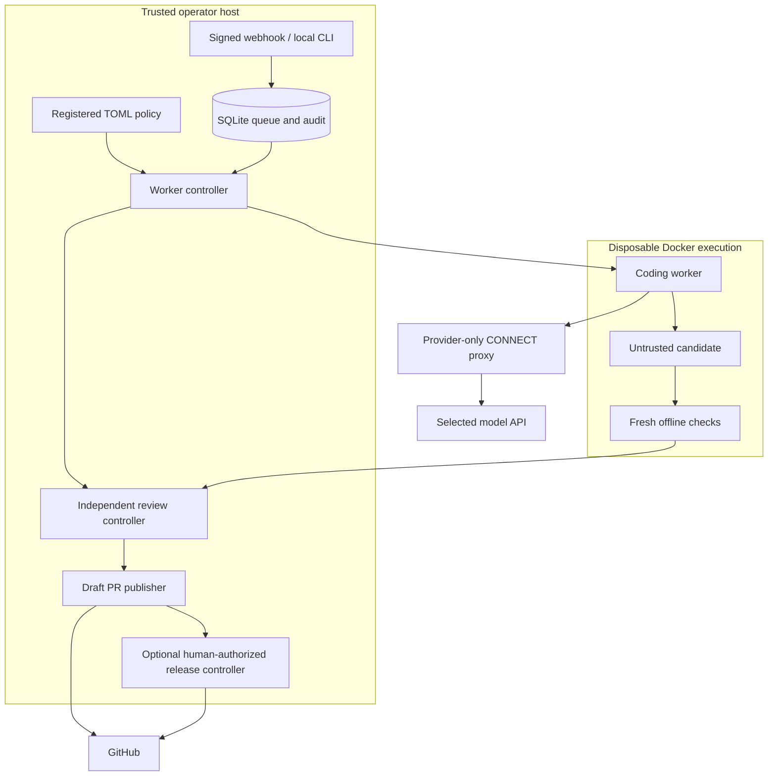

# Architecture and engineering decisions

The dispatcher turns a feedback report into a reviewable change while keeping
execution, verification, publication, and release authority separate. Its main
engineering problem is preserving that separation through retries, changed
reports, moved Git branches, and ambiguous provider responses.

## Five-minute code tour

| Concern | Implementation | Useful tests |
| --- | --- | --- |
| Signed intake and eligibility | `linear.py`, `server.py` | `test_linear.py` |
| Durable queue, leases, cancellation, audit | `store.py` | `test_store.py` |
| Committed snapshots and path policy | `workspace.py` | `test_workspace.py` |
| Container and egress boundaries | `runner.py`, `egress_proxy.py` | `test_docker.py`, `test_egress.py` |
| Baseline, regression, fresh verification | `worker.py` | `test_worker.py` |
| Independent review and bounded repairs | `review_gate.py`, `reviewer.py` | `test_review_gate.py`, `test_reviewer.py` |
| Draft publication and reconciliation | `publish.py` | `test_publish.py` |
| Human release approvals and progress | `release_store.py`, `release_controller.py` | `test_linear_release.py` |

Core files live in `src/sdlc_dispatcher/`; application adapters live in
`integrations/deck-lab/`. Start with the deterministic `demo` in `cli.py`, then
follow `Worker` orchestration and the tests for failure paths.

## Decisions and tradeoffs

**SQLite and one execution slot.** Transactions make intake deduplication,
approval changes, claims, and audit records durable without a queue service.
One global coding slot keeps resource usage predictable on a small host. This
limits throughput and availability; running more hosts requires a different
coordination design, not merely more worker processes.

**Committed snapshots instead of working-tree mounts.** Source is exported from
Git with credential/config inheritance disabled. Symlinks, submodules, unsafe
paths, and protected changes are rejected. This keeps dirty edits and host Git
credentials out of the candidate workspace, at the cost of requiring committed
input and trusted prebuilt development images.

**Independent verification.** A candidate must pass baseline and fresh checks;
new regression tests must fail on the original source. Agent-reported success is
insufficient. That catches unsupported fixes, but a passing test suite still only
covers the behavior it asserts. Independent model review is another signal,
not proof of correctness.

**Authority bound to evidence.** Report revisions can revoke approval. Review
receipts bind the candidate and policy. Publication rechecks current eligibility
and base identity. The optional release path records the human actor, reviewed
head, and evidence digest, then checks live state again before mutations.

**Persist intent, then reconcile.** The controller cannot make GitHub and SQLite
one atomic transaction. It records publication/deployment intent before the remote
write and inspects remote state after ambiguous responses. It does not promise
exactly-once delivery or blindly repeat a deployment. Tests exercise lost responses,
changed heads, revoked approval, and mismatched live receipts.

**Small runtime dependency surface.** The core uses Python's standard library;
Waitress is an optional server dependency. Git, Docker, trusted development images,
and provider CLIs are external operational dependencies. Reducing Python packages
does not remove the need to maintain those components.

## Present limits

- A single trusted host and operator account are failure domains. There is no
  multi-tenant service, high-availability queue, or distributed scheduler.
- Live source refresh currently uses anonymous GitHub access; private-source
  onboarding needs an appropriate read-only adapter.
- The Deck Lab integration contains deployment-specific paths and routing IDs.
  Start a new integration from `examples/project.toml`, not its live registration.
- DigitalOcean operations require the separate `decklab-infra` scripts and private
  activation record. A source checkout defaults to a sibling `decklab-infra`;
  set `DISPATCHER_INFRA_ROOT` for another location or an installed wheel.
- Model availability and behavior depend on the provider. The local demo uses
  a deterministic fake agent and makes no claims about model quality.
- Browser evidence is synthetic. Screenshots/video are optional and currently
  disabled by default in Deck Lab; behavioral assertions are not visual review.

Next priorities are extracting a generic deployment-provider interface, replacing
owner-session release credentials with narrowly scoped service credentials, and
expanding fault-injection coverage. These are roadmap items, not implemented features.
